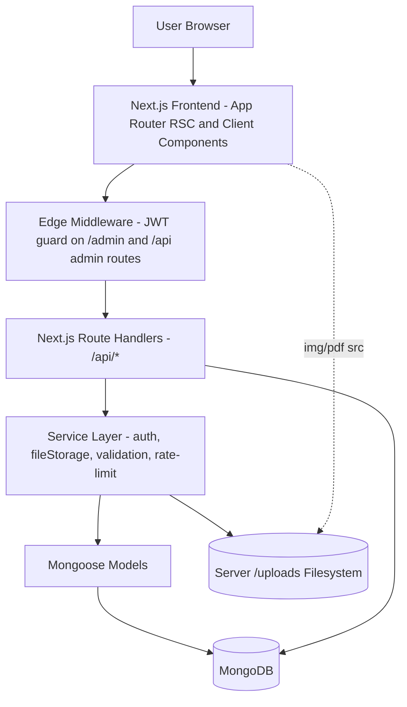
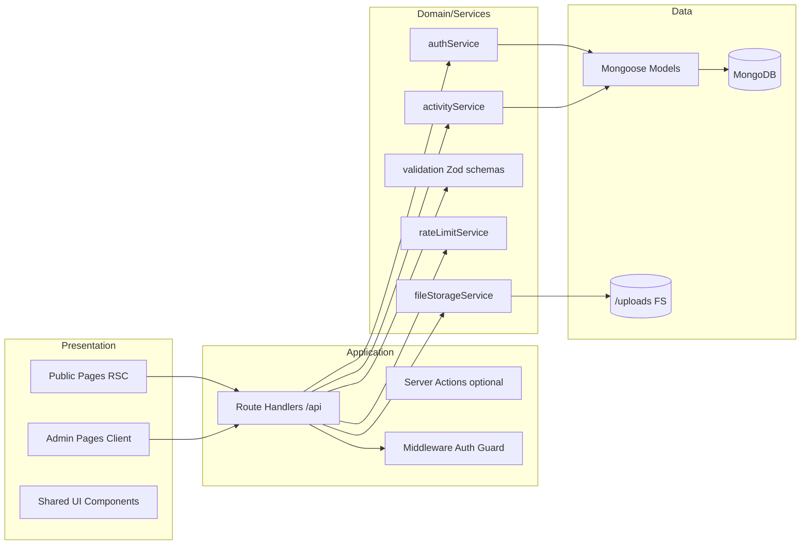
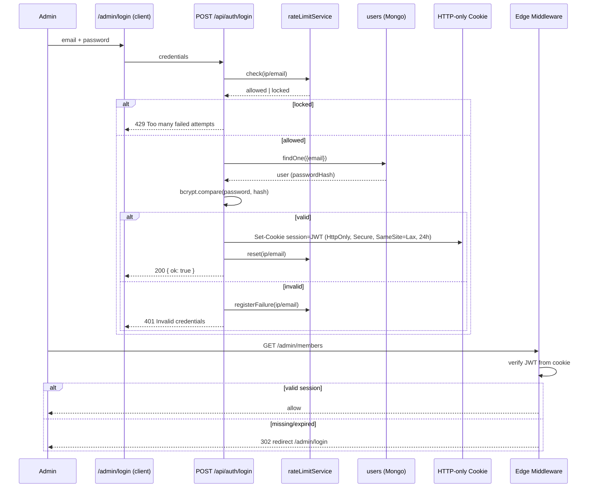
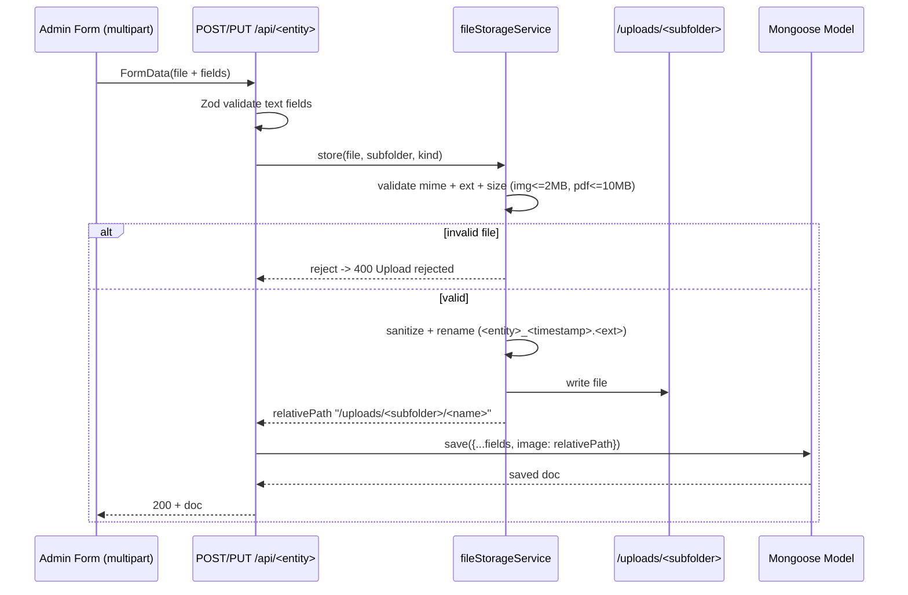
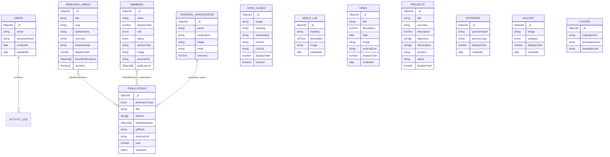

# Design Document: Prism Lab IIT Patna Web Platform

> Section numbering below is for cross-reference convenience. Canonical Kiro design sections (Overview, Architecture, Components and Interfaces, Data Models, Correctness Properties, Error Handling, Testing Strategy) are present as top-level headings.

## Overview
<a id="sec-1"></a>
**(Section 1)**

The Prism Lab IIT Patna Web Platform is a full-stack academic research lab website paired with a single-admin Content Management System (CMS). It is built as one Next.js 14 (App Router) full-stack project in TypeScript, backed by MongoDB via Mongoose, with all media stored on the server filesystem under `/uploads` (only relative paths and metadata are persisted in MongoDB).

The platform has two surfaces sharing one codebase and one database:

- **Public User Panel** — a premium, SEO-optimized, responsive, animated read-only website that showcases research areas, projects, sponsors, the Principal Investigator (PI), members, publications, news, and a gallery.
- **Admin CMS** — a JWT-protected (HTTP-only cookie) dashboard at `/admin/*` through which a single admin performs full CRUD on every content element, uploads media, reorders content, and links entities (research↔publications, publications↔members). Changes reflect instantly on the public site with no redeployment.

This design is the authoritative technical translation of the PRD/SRS (`PRD.md`). It is organized to satisfy seven documentation concerns explicitly: System Design (§3, §4), User Panel Spec (§7), Admin Panel Spec (§8), Tech Stack (§2), API Contract (§9), Architecture Matrix (§10), and File Structure (§11). High-level (architecture, components, data models) and low-level (TypeScript interfaces, algorithms, function signatures with formal specifications) design are both included.

### 1.1 Design Goals

| Goal | Source | Design Implication |
| --- | --- | --- |
| Fully dynamic content | PRD §1, §39 | No hardcoded content; every section reads from MongoDB. |
| Single full-stack project | PRD §7.2 | Next.js App Router + Route Handlers; no separate backend. |
| Media off-DB / off-Git | PRD §8, §12 | Filesystem storage under `/uploads`; DB stores relative paths. |
| Secure single admin | PRD §40, §74–81 | JWT + HTTP-only cookie, bcrypt, rate limiting, middleware. |
| SEO-first | PRD §82 | Per-page metadata, OG/Twitter, canonical, sitemap, robots. |
| Premium UX | PRD §18, §87 | Framer Motion, dark/light theme, responsive breakpoints. |
| Long-term maintainability | PRD §3.4 | Modular components, typed models, reusable API conventions. |

### 1.2 Scope Boundaries

In scope: everything in PRD Parts 1–5. Explicitly out of scope (no design surface): multi-admin roles, payment gateway, student portal, email system, live chat, notifications, forum, comments. Alumni and Collaborators pages are in scope but render future-ready empty states.

---

## 2. Tech Stack

This section consolidates PRD §7 and §95 as the authoritative dependency contract.

### 2.1 Core Stack

| Layer | Technology | Version / Notes | Role in Design |
| --- | --- | --- | --- |
| Frontend framework | Next.js | 14 (App Router) | Pages, layouts, RSC, metadata, image optimization. |
| Backend | Next.js Route Handlers | `app/api/**/route.ts` | REST-style JSON endpoints. |
| Runtime | Node.js | LTS (18+/20+) | Server process under PM2. |
| Language | TypeScript | 5.x, `strict` | End-to-end type safety. |
| Database | MongoDB | Community Edition | Document store for all content metadata. |
| ODM | Mongoose | 8.x | Schemas, validation, relationships, population. |
| Styling | Tailwind CSS | 3.x | Utility-first responsive styling. |
| Components | ShadCN UI | Radix-based | Accessible primitives (dialog, dropdown, table, form). |
| Animation | Framer Motion | 11.x | Scroll reveal, 3D card hover, page/route transitions. |
| Rich text editor | TipTap | 2.x | PI sections, about, news, project descriptions, bios. |
| Auth | JWT | `jose` (Edge-safe) | Signed session token in HTTP-only cookie. |
| Validation | Zod | 3.x | Request/body validation shared client+server. |
| Theme | next-themes | latest | Light/dark with persistence (no flash). |
| Tables | TanStack Table | v8 | Publication/project/member admin + public tables. |
| File upload | Multer-equivalent | See §2.2 | Multipart parsing → filesystem. |
| Icons | Lucide React | latest | Iconography across both panels. |
| Password hashing | bcrypt | `bcryptjs` | Admin password hashing. |

### 2.2 Upload Handling Note (Multer in App Router)

Multer is Express middleware and does not bind directly to Next.js Route Handlers. The design preserves the PRD's intent (server-side multipart handling, validation, sanitized renaming, filesystem persistence) using the Web `Request.formData()` API available in Route Handlers, wrapped in a dedicated `fileStorage` service (§8.13, §11). Where the PRD says "Multer", the implementation uses an equivalent multipart handler with identical validation rules. This is a faithful adaptation, not a scope change.

### 2.3 Environment Variables (PRD §81)

```env
MONGODB_URI=
JWT_SECRET=
ADMIN_EMAIL=
ADMIN_PASSWORD=
NEXT_PUBLIC_BASE_URL=
UPLOAD_DIR=            # defaults to ./uploads (dev) or /var/www/prism/uploads (prod)
SESSION_TTL_HOURS=24
RATE_LIMIT_MAX=5
RATE_LIMIT_WINDOW_MIN=15
```

`.env.local` is never committed. Secrets are never imported into client components.

---

## Architecture
<a id="sec-3"></a>
**(Section 3: System Design — High-Level Architecture)**

### 3.1 Request/Data Flow (PRD §8)



Key principle: the browser renders content from Next.js; static-ish public reads are server-rendered for SEO; mutations flow through `/api/*` guarded by middleware; binary files live on disk and are referenced by relative path stored in MongoDB.

### 3.2 Layered Architecture



### 3.3 Rendering Strategy

| Surface | Strategy | Reason |
| --- | --- | --- |
| Public pages (home, research, people, publications) | Server Components with dynamic data fetch + `revalidate` tags | SEO + freshness after admin edits without redeploy. |
| Public interactive widgets (hero carousel, gallery lightbox, marquee, theme toggle, animated cards) | Client Components | Browser-only behavior (timers, pointer, motion). |
| Admin pages | Client Components calling `/api/*` | Forms, optimistic UI, TanStack Table, TipTap. |
| API | Route Handlers (Node runtime for FS/bcrypt) | Filesystem + bcrypt require Node runtime; middleware runs on Edge. |

After a successful admin mutation, the affected public route's cache tag is revalidated so the change appears immediately (PRD §39 "reflect instantly... without redeployment").

### 3.4 Authentication & Session Architecture (PRD §40, §74–78)



### 3.5 File Upload Architecture (PRD §12, §13, §59, §79)



Subfolders (PRD §59): `hero`, `members`, `pi`, `research`, `publications`, `sponsors`, `gallery`, `resumes`, `news`.

---

## 4. Domain Model & Relationships (High-Level Data Design)

### 4.1 Entity Relationship Diagram (PRD §57, §58)



### 4.2 Relationship Semantics

| Relationship | Cardinality | Storage | Sync Rule |
| --- | --- | --- | --- |
| `research_areas.linkedPublications → publications` | many-to-many (one-directional reference) | array of `ObjectId` on research area | Admin multi-selects; details page populates publications. |
| `publications.linkedMembers ↔ members.publications` | many-to-many (bidirectional) | `ObjectId[]` on both sides | On publication create/update, the set difference of `linkedMembers` is applied to each member's `publications` (add/remove) atomically. |
| PI as mandatory author | constraint | PI represented as an author entry; PI must be selected | Validation rejects publication save if PI not among authors. |
| `authors` (string[]) vs `linkedMembers` (ObjectId[]) | parallel | both stored | `authors` preserves free-text display order including external co-authors; `linkedMembers` drives profile back-links. |

Bidirectional sync is the single most error-prone invariant; it is specified formally in §8.10.3 and covered by correctness properties in §12.

### 4.3 Singleton vs Collection Entities

| Entity | Cardinality | Notes |
| --- | --- | --- |
| `users` | exactly 1 (single admin) | Seeded from env on first boot. |
| `about_lab` | 1 logical record | GET/PUT only (no create/delete). |
| `principal_investigator` | 1 logical record | GET/PUT only. |
| `footer` | 1 logical record | GET/PUT only. |
| `hero_slides` | exactly 3 active | CRUD + reorder; UI enforces 3 active. |
| All others | 0..N | Full CRUD + reorder. |

---

## Data Models
<a id="sec-5"></a>
**(Section 5: Low-Level — TypeScript & Mongoose)**

All models live in `/models`. TypeScript interfaces live in `/types`. Enums and validation are shared with Zod schemas in `/lib/validation`.

### 5.1 Shared Types & Enums

```typescript
// types/common.ts
export type ID = string; // serialized ObjectId

export type RichText = string; // sanitized TipTap HTML

export interface Section {
  heading: string;
  content: string; // textarea or rich text per PRD §30/§46
  order: number;
}

export type MemberRole = 'PhD' | 'MTech' | 'BTech' | 'Intern';
export type MemberStatus = 'Ongoing' | 'Completed';
export type PublicationType =
  | 'Journal' | 'Conference' | 'BookChapter'
  | 'Patent' | 'Dataset' | 'InvitedTalk';
export type GalleryCategory = 'Research & Activities' | 'Group Discussion';

export interface ApiOk<T>  { ok: true;  data: T }
export interface ApiErr    { ok: false; error: string; code: string; fields?: Record<string,string> }
export type ApiResponse<T> = ApiOk<T> | ApiErr;
```

### 5.2 User (PRD §58.1)

```typescript
// types/user.ts
export interface User {
  _id: ID;
  email: string;
  passwordHash: string;   // bcrypt, never returned to client
  createdAt: Date;
  updatedAt: Date;
}
```

```typescript
// models/User.ts (Mongoose shape)
const UserSchema = new Schema<User>({
  email:        { type: String, required: true, unique: true, lowercase: true, trim: true },
  passwordHash: { type: String, required: true, select: false },
}, { timestamps: true });
```

### 5.3 Hero Slide (PRD §58.2, §43)

```typescript
export interface HeroSlide {
  _id: ID;
  image: string;          // /uploads/hero/...
  heading: string;
  subheading: string;
  ctaText: string;
  ctaLink: string;
  displayOrder: number;
  isActive: boolean;      // exactly 3 active rendered on home
}
```

### 5.4 About Lab (PRD §58.3) — singleton

```typescript
export interface AboutLab {
  _id: ID;
  heading: string;
  description: RichText;
  image?: string;         // /uploads/news or dedicated about asset
  displayOrder?: number;
  updatedAt: Date;
}
```

### 5.5 News (PRD §58.4, §45)

```typescript
export interface News {
  _id: ID;
  title: string;
  description: RichText;
  date: Date;
  image?: string;         // /uploads/news/...
  externalLink?: string;
  displayOrder: number;
  createdAt: Date;
}
```

### 5.6 Research Area (PRD §58.5, §30, §46)

```typescript
export interface ResearchArea {
  _id: ID;
  title: string;
  slug: string;           // unique, SEO URL: /research/areas/[slug]
  authorName: string;
  overview: string;
  featureImage?: string;  // /uploads/research/...
  displayOrder: number;
  linkedPublications: ID[]; // -> publications
  sections: Section[];    // unlimited dynamic { heading, content, order }
  createdAt: Date;
  updatedAt: Date;
}
```

```typescript
// Mongoose: slug auto-generated + uniqueness enforced (see §8.7.1)
ResearchAreaSchema.index({ slug: 1 }, { unique: true });
ResearchAreaSchema.index({ displayOrder: 1 });
```

### 5.7 Project (PRD §58.6, §47)

```typescript
export interface Project {
  _id: ID;
  title: string;
  overview: string;
  description: RichText;
  objectives: string[];
  deliverables: string[];
  duration: string;
  status: string;         // e.g. Ongoing | Completed | Planned
  displayOrder: number;
  createdAt: Date;
  updatedAt: Date;
}
```

### 5.8 Sponsor (PRD §58.7, §48)

```typescript
export interface Sponsor {
  _id: ID;
  sponsorName: string;
  sponsorLogo: string;    // /uploads/sponsors/...
  displayOrder: number;
  createdAt: Date;
}
```

### 5.9 Principal Investigator (PRD §58.8, §49) — singleton

```typescript
export interface PrincipalInvestigator {
  _id: ID;
  name: string;
  designation: string;
  image?: string;         // /uploads/pi/...
  email?: string;
  website?: string;
  scholarLink?: string;
  linkedIn?: string;
  overview: RichText;
  research: RichText;
  teaching: RichText;
  publications: RichText;
  education: RichText;
  activities: RichText;
  achievements: RichText;
  updatedAt: Date;
}
```

### 5.10 Member (PRD §58.9, §50, §34)

```typescript
export interface Member {
  _id: ID;
  name: string;                 // required
  displayOrder: number;         // required
  role: MemberRole;             // required enum
  status: MemberStatus;         // required enum
  sessionYear?: string;         // e.g. "2024" — used for year grouping
  image?: string;               // /uploads/members/...
  resumePdf?: string;           // /uploads/resumes/...
  biography?: RichText;
  email?: string;
  website?: string;
  scholar?: string;
  github?: string;
  linkedIn?: string;
  twitterX?: string;
  publications: ID[];           // <-> publications.linkedMembers
  createdAt: Date;
}
```

```typescript
MemberSchema.index({ role: 1, displayOrder: 1 });
MemberSchema.index({ role: 1, sessionYear: -1, status: 1 });
```

### 5.11 Publication (PRD §58.10, §51) — discriminated metadata

```typescript
export interface JournalMeta    { journalName: string; paperTitle?: string }
export interface ConferenceMeta { conferenceName: string; placeDate: string }
export interface BookMeta       { publisher: string; volume?: string; edition?: string; pages?: string }
export interface PatentMeta     { patentType: string; patentNumber: string; status: string; issuedDate?: string }
export interface DatasetMeta    { body: RichText }       // free-form
export interface InvitedTalkMeta{ body: RichText }       // free-form

export type PublicationMeta =
  | JournalMeta | ConferenceMeta | BookMeta
  | PatentMeta | DatasetMeta | InvitedTalkMeta;

export interface Publication {
  _id: ID;
  publicationType: PublicationType;
  title: string;
  authors: string[];          // display-order names (incl. external co-authors), PI mandatory
  linkedMembers: ID[];        // -> members; back-synced to member.publications
  pdfPath?: string;           // /uploads/publications/...
  externalLink?: string;
  year: number;               // sort key (desc)
  metadata: PublicationMeta;  // shape depends on publicationType
  createdAt: Date;
  updatedAt: Date;
}
```

```typescript
PublicationSchema.index({ publicationType: 1, year: -1 });
PublicationSchema.index({ title: 'text', authors: 'text' }); // search
```

### 5.12 Gallery (PRD §58.11, §52)

```typescript
export interface GalleryItem {
  _id: ID;
  image: string;              // /uploads/gallery/...
  category: GalleryCategory;
  displayOrder: number;
  createdAt: Date;
}
```

### 5.13 Footer (PRD §58.12, §53) — singleton

```typescript
export interface Footer {
  _id: ID;
  copyrightText: string;
  developerName: string;      // default "Amit Kumar"
  developerLink: string;      // default https://amit-three.vercel.app/
}
```

### 5.14 Activity Log (supports Dashboard recent activity, PRD §41)

```typescript
export interface ActivityLog {
  _id: ID;
  entity: string;             // 'member' | 'publication' | 'gallery' | ...
  action: 'create' | 'update' | 'delete';
  label: string;              // human-readable summary
  createdAt: Date;
}
```

This collection is not in the PRD's schema list but is the minimal store required to implement the PRD-mandated "Recent Activity" dashboard panel. It is internal/derived and carries no user-facing content.

---

## Components and Interfaces
<a id="sec-components"></a>

This design's components and interfaces are documented across the following sections, each addressing one of the requested documentation concerns:

- **Section 6 — Cross-Cutting Frontend Concerns**: global components (navbar, theme provider, motion wrappers, responsive shell, empty states).
- **Section 7 — User Panel Specification**: public page components and their data contracts.
- **Section 8 — Admin Panel Specification**: CMS module components, service interfaces, and formal function specs.
- **Section 9 — API Contract**: the interface boundary between frontend and backend (Route Handlers).
- **Section 10 — Architecture Matrix**: how each component maps across the full stack.
- **Section 11 — File / Folder Structure**: physical component organization.

### 6. Cross-Cutting Frontend Concerns (Global)

These apply to every page (PRD §18).

### 6.1 Responsive Breakpoints (PRD §18.1, §84)

| Name | Range | Tailwind | Layout behavior |
| --- | --- | --- | --- |
| Mobile | 320–767px | base / `sm:` | Single column, hamburger nav, stacked cards, touch targets ≥44px. |
| Tablet | 768–1024px | `md:` | 2-column grids, condensed nav. |
| Desktop | 1025px+ | `lg:`/`xl:` | Full multi-column experience, horizontal nav with dropdowns. |

### 6.2 Theme (PRD §18.2, §86)

`next-themes` with `class` strategy, `defaultTheme="system"`, persisted in `localStorage`, no flash-of-wrong-theme (inline script in root layout). All ShadCN tokens defined for both modes with accessible contrast (WCAG AA targeted; full validation requires manual testing).

### 6.3 Motion (PRD §18.3, §87)

| Effect | Where | Implementation |
| --- | --- | --- |
| Page/route transition | All routes | `AnimatePresence` wrapper in layout; fade/slide. |
| Scroll reveal | Section entrances | `whileInView` fade-up, `viewport={{ once: true }}`. |
| 3D card hover | member/research/publication/sponsor cards | tilt + elevation + scale on hover. |
| Navbar dropdown | desktop hover / mobile click | animated reveal. |
| Button micro-interactions | all buttons | hover scale + shadow. |

Constraint: subtle, professional, research-oriented; no flashy motion. `prefers-reduced-motion` disables non-essential animation.

### 6.4 Navbar (PRD §18.4, §15)

Sticky, responsive, accessible. Desktop horizontal with hover dropdowns; mobile hamburger with click dropdowns. Structure:

```
Home
Research ▸ Areas | Projects | Sponsors
Publications ▸ Journal | Conference | Book Chapters | Patents | Datasets | Invited Talks
People ▸ Principal Investigator | Current Members | Alumni | Collaborators
```

### 6.5 Global Edge Cases (PRD §88)

| Case | Behavior |
| --- | --- |
| Empty research | Render "No research areas available". |
| Empty publications | Render "No publications available". |
| Missing image | Render fallback placeholder (`/public/placeholder.*`). |
| Missing PDF | Hide "Download PDF" button entirely. |
| External link | `target="_blank" rel="noopener noreferrer"`. |
| Empty collaborators | "Collaborators will be updated soon." |
| Empty alumni | "Alumni information coming soon." |

---

## 7. User Panel Specification (Public)

Read-only surface. All data fetched server-side for SEO; interactive widgets hydrate as client components. Sorting/search/filter rules are normative.

### 7.1 Route Map

| Route | Page | Data Source | Render |
| --- | --- | --- | --- |
| `/` | Home | hero, about, news, research, PI, projects, members, sponsors, gallery, footer | RSC + client widgets |
| `/research/areas` | Research Areas list | research_areas (by displayOrder) | RSC + search |
| `/research/areas/[slug]` | Research Detail | research_area + populated publications | RSC |
| `/research/projects` | Projects table | projects (by displayOrder) | RSC + table |
| `/research/sponsors` | Sponsors | sponsors (by displayOrder) | RSC |
| `/people/principal-investigator` | PI profile | principal_investigator | RSC |
| `/people/current-members` | Members | members grouped (see §7.8) | RSC + filters/search |
| `/people/current-members/[id]` | Member profile | member + populated publications | RSC |
| `/people/alumni` | Alumni | — | Empty state |
| `/people/collaborators` | Collaborators | — | Empty state |
| `/publications/journal` | Journal table | publications type=Journal | RSC + table |
| `/publications/conference` | Conference table | publications type=Conference | RSC + table |
| `/publications/book-chapters` | Book Chapters table | publications type=BookChapter | RSC + table |
| `/publications/patents` | Patents table | publications type=Patent | RSC + table |
| `/publications/datasets` | Datasets | publications type=Dataset | RSC (free-form) |
| `/publications/invited-talks` | Invited Talks | publications type=InvitedTalk | RSC (free-form) |

### 7.2 Home Page (PRD §19–28)

Vertical flow: Hero → About+News → Research Areas preview → PI → Projects preview → Members preview → Sponsors → Gallery → Footer → Developer credit.

#### 7.2.1 Hero (PRD §20, §43)

- Exactly 3 active slides; auto-scroll every 3000ms; Prev/Next manual controls.
- Manual interaction pauses autoplay (resets timer).
- Each slide: image, heading, subheading, CTA text + link.
- Transitions: fade/parallax/scale.

Carousel control algorithm:

```typescript
// components/public/HeroCarousel.tsx (client)
// Precondition: slides.length === 3 (filtered isActive, sorted displayOrder)
// Postcondition: exactly one slide visible; index always in [0, slides.length)
function useHeroCarousel(slides: HeroSlide[], intervalMs = 3000) {
  const [index, setIndex] = useState(0);
  const [paused, setPaused] = useState(false);

  const next = () => setIndex(i => (i + 1) % slides.length);
  const prev = () => setIndex(i => (i - 1 + slides.length) % slides.length);

  useEffect(() => {
    if (paused || slides.length <= 1) return;
    const t = setInterval(next, intervalMs);
    return () => clearInterval(t);   // invariant: at most one active timer
  }, [paused, slides.length, intervalMs]);

  // manual nav pauses autoplay
  const onManual = (dir: 'prev' | 'next') => { setPaused(true); dir === 'next' ? next() : prev(); };
  return { index, next, prev, onManual, setPaused };
}
```

#### 7.2.2 About + News (PRD §21)

Two-column equal-height layout. Left: about (heading, rich description, optional image). Right: news feed sorted newest-first by `date`; each item shows title, description, date, optional image, optional "Read More" (only when `externalLink` present, opens new tab with `noopener noreferrer`).

#### 7.2.3 Research Areas Preview (PRD §22)

Few cards (e.g., first N by `displayOrder`): research name, author name, overview, "Read More" → `/research/areas/[slug]`. "Explore All Research Areas" → `/research/areas`. 3D hover.

#### 7.2.4 PI Section (PRD §23)

Profile image, overview, short summary, "View Profile" → `/people/principal-investigator`.

#### 7.2.5 Projects Preview (PRD §24)

Overview-only cards (title + short overview). "View All Projects" → `/research/projects`. Premium hover.

#### 7.2.6 Members Preview (PRD §25)

Few member cards (image, name, role). 3D hover. "View All Members" → `/people/current-members`.

#### 7.2.7 Sponsors Marquee (PRD §26)

Infinite smooth right-to-left marquee of logo + name; continuous auto movement; pause on hover. Implemented by duplicating the list and animating translateX with CSS/Framer; pause toggles animation play state.

#### 7.2.8 Gallery (PRD §27)

- Filter buttons: "Research & Activities" and "Group Discussion".
- Carousel moves right→left, auto every 2000ms; Prev/Next manual; manual pauses autoplay.
- Click image → fullscreen lightbox modal with Close, Prev, Next, Zoom.

#### 7.2.9 Footer + Developer Credit (PRD §28, §53)

Left: copyright/all rights reserved. Right: "Designed & Developed by Amit Kumar" linking to `https://amit-three.vercel.app/` (new tab, `noopener noreferrer`). All text from footer record.

### 7.3 Research Areas List (PRD §29)

Search by research topic (client-side filter on title/author/overview). Cards: research name, author name, about, "Read More". Sorted by admin `displayOrder` ascending.

### 7.4 Research Detail (PRD §30)

`/research/areas/[slug]`. Renders unlimited dynamic `sections` (heading + content) in `order`. Linked publications populated and displayed. 404 if slug not found.

### 7.5 Projects Page (PRD §31)

TanStack Table columns: Project Title, Overview, Description, Objectives, Deliverables, Duration, Status. Sorted by `displayOrder`. Pagination for large sets.

### 7.6 Sponsors Page (PRD §32)

Grid of logo + sponsor name, sorted by `displayOrder`.

### 7.7 PI Page (PRD §33)

Sections rendered with rich formatting: Overview, Research, Teaching, Publication, Education, Activities, Achievement. Plus header (name, designation, image) and links (email, website, scholar, LinkedIn). Empty rich-text sections are omitted.

### 7.8 Current Members Page (PRD §34) — grouping/sorting (normative)

Status filter buttons: Ongoing / Completed. Search by member name.

Grouping rules:

- **PhD**: no year grouping; sorted strictly by `displayOrder` ascending.
- **MTech / BTech / Intern**: grouped by `sessionYear` descending (2025, 2024, 2023, …); within each year split into Ongoing/Completed.

```typescript
// lib/members/group.ts
// Postcondition: PhD list ordered by displayOrder asc; other roles bucketed by year desc.
interface GroupedMembers {
  phd: Member[];                                   // displayOrder asc
  byRoleYear: Record<Exclude<MemberRole,'PhD'>,    // MTech|BTech|Intern
    Array<{ year: string; ongoing: Member[]; completed: Member[] }>>; // year desc
}

function groupMembers(members: Member[], statusFilter?: MemberStatus): GroupedMembers { /* see §8.10.4 */ }
```

Member card: image, name, role, year; 3D hover; click → `/people/current-members/[id]`.

### 7.9 Member Profile (PRD §35)

Profile image, biography, resume (download button hidden if no `resumePdf`), email, website, Google Scholar, GitHub, LinkedIn, Twitter/X, and auto-linked publications (populated from `member.publications`). Missing image → placeholder. External links open safely.

### 7.10 Alumni & Collaborators (PRD §36, §37)

Future-ready empty states with the exact PRD copy.

### 7.11 Publications Pages (PRD §38, §51)

All sorted by `year` descending; search by paper title. Per-type tables:

| Type | Route | Columns |
| --- | --- | --- |
| Journal | `/publications/journal` | S.No, Authors, Paper Title (clickable→link/PDF), Journal Name, Year |
| Conference | `/publications/conference` | SN, Authors, Conference Title, Conference Name, Place & Date, Year |
| Book Chapters | `/publications/book-chapters` | Authors, Title, Publisher, Year, Volume, Edition, Pages |
| Patents | `/publications/patents` | Authors, Title, Patent Type, Patent Number, Issued Date, Status |
| Datasets | `/publications/datasets` | Free-form (rendered `metadata.body` rich text) |
| Invited Talks | `/publications/invited-talks` | Free-form (rendered `metadata.body` rich text) |

Clickable title resolves to `externalLink` if present, else `pdfPath` if present, else plain text. Empty type → "No publications available". Pagination for large tables.

---

## 8. Admin Panel Specification (CMS)

JWT-protected (HTTP-only cookie) surface at `/admin/*`. Every section supports the CRUD/upload/reorder operations defined per the PRD. Save flow (PRD §55): validate → upload file to `/uploads` → save metadata in MongoDB → public site revalidates → instant reflection, no redeploy.

### 8.1 Admin Route Map

| Route | Module | Protected |
| --- | --- | --- |
| `/admin/login` | Login (hidden, not in navbar) | No (public) |
| `/admin` | Dashboard | Yes |
| `/admin/hero` | Hero CMS | Yes |
| `/admin/about` | About Lab CMS | Yes |
| `/admin/news` | News CMS | Yes |
| `/admin/research` | Research Areas CMS | Yes |
| `/admin/projects` | Projects CMS | Yes |
| `/admin/sponsors` | Sponsors CMS | Yes |
| `/admin/principal-investigator` | PI CMS | Yes |
| `/admin/members` | Members CMS | Yes |
| `/admin/publications` | Publications CMS (6 tabs) | Yes |
| `/admin/gallery` | Gallery CMS | Yes |
| `/admin/footer` | Footer CMS | Yes |
| `/admin/settings` | Settings | Yes |

### 8.2 Sidebar (PRD §42)

Collapsible, responsive, dark-mode compatible. Order: Dashboard, Hero, About, News, Research (Areas/Projects/Sponsors), Principal Investigator, Members, Publications (Journal/Conference/Book Chapters/Patents/Datasets/Invited Talks), Gallery, Footer, Settings, Logout.

### 8.3 Authentication Module (PRD §40, §75–78)

#### 8.3.1 Login function (formal spec)

```typescript
// lib/auth/authService.ts  (Node runtime)
async function login(email: string, password: string, clientKey: string): Promise<ApiResponse<{ ok: true }>>;
```

Preconditions:
- `email` non-empty, valid format; `password` non-empty.
- `clientKey` derived from IP (+email) for rate limiting.

Postconditions:
- If `clientKey` is locked → return `{ ok:false, code:'RATE_LIMITED' }` (HTTP 429); no DB read.
- Else if no user / bcrypt mismatch → register failure; return `{ ok:false, code:'INVALID_CREDENTIALS' }` (HTTP 401).
- Else → sign JWT (`sub=userId`, `exp=now+SESSION_TTL`), set HTTP-only cookie (`HttpOnly; Secure; SameSite=Lax; Path=/; Max-Age=TTL`), reset failure counter; return `{ ok:true }` (HTTP 200).
- No plaintext password is ever stored or logged.

```typescript
async function login(email, password, clientKey) {
  if (rateLimit.isLocked(clientKey))
    return err('RATE_LIMITED', 'Too many failed attempts. Please try again later.');

  const user = await User.findOne({ email: email.toLowerCase() }).select('+passwordHash');
  const valid = user ? await bcrypt.compare(password, user.passwordHash) : false;

  if (!valid) {
    rateLimit.registerFailure(clientKey);   // see §8.3.3
    return err('INVALID_CREDENTIALS', 'Invalid credentials');
  }
  rateLimit.reset(clientKey);
  await setSessionCookie(signJwt({ sub: user._id }, ttlHours));
  return ok({ ok: true });
}
```

#### 8.3.2 Session verification

```typescript
// Edge middleware verifies JWT signature + expiry from cookie.
async function verifySession(token?: string): Promise<{ userId: ID } | null>;
// GET /api/auth/me returns { authenticated: boolean }
// POST /api/auth/logout clears cookie (Max-Age=0).
```

#### 8.3.3 Rate limiting (PRD §77) — formal spec

```typescript
// lib/auth/rateLimit.ts
interface Attempt { count: number; lockedUntil?: number }
const store = new Map<string, Attempt>(); // in-process; pluggable to Mongo/Redis later

function isLocked(key: string): boolean;          // now < lockedUntil
function registerFailure(key: string): void;      // count++; if count>=MAX lock for WINDOW
function reset(key: string): void;                // clear on success
```

Invariant: after `RATE_LIMIT_MAX` (default 5) consecutive failures, `lockedUntil = now + RATE_LIMIT_WINDOW_MIN` (default 15 min); successful login or window expiry resets the counter. Deployment note: single PM2 instance keeps the in-process map authoritative; a multi-instance future requires a shared store (flagged for scalability, PRD §94).

#### 8.3.4 Middleware route protection (PRD §76)

```typescript
// middleware.ts  — runs on Edge for all /admin and mutating /api routes
export const config = { matcher: ['/admin/:path*', '/api/:path*'] };
// Logic:
//  - allow /admin/login and POST /api/auth/login unauthenticated
//  - for other /admin/* : no valid session -> 302 /admin/login
//  - for mutating /api/* (POST/PUT/DELETE, and admin GETs) : no valid session -> 401 JSON
//  - public GET /api/* (content reads) allowed
```

### 8.4 Dashboard (PRD §41)

- **Stat cards** (live counts): Total Members, PhD, MTech, BTech, Interns, Total Publications, Research Areas, Projects, Sponsors, Gallery Images, News Items.
- **Quick actions**: Add Member, Add Publication, Add Research, Add News, Upload Gallery.
- **Recent activity**: latest `ActivityLog` entries (updated members, recent uploads, new publications).

```typescript
// GET /api/dashboard/stats -> aggregated counts (one $facet aggregation across collections or parallel countDocuments)
interface DashboardStats {
  members: { total:number; phd:number; mtech:number; btech:number; intern:number };
  publications: number; researchAreas: number; projects: number;
  sponsors: number; galleryImages: number; newsItems: number;
}
```

### 8.5 Hero CMS (PRD §43)

Add/Edit/Delete/Reorder slides. Fields: image (≤2MB; jpg/jpeg/png/webp), heading, subheading, ctaText, ctaLink, displayOrder. UI enforces exactly 3 active slides on home; admin warned if active count ≠ 3. Save auto-updates homepage.

### 8.6 About / News CMS (PRD §44, §45)

- **About** (singleton): heading, rich description, optional image, displayOrder. GET/PUT.
- **News**: Add/Edit/Delete/Publish. Required: title, description, date. Optional: image, externalLink, displayOrder. Homepage sorts newest-first.

### 8.7 Research Areas CMS (PRD §46)

CRUD + publish. Fields: title, authorName, overview, optional featureImage, displayOrder. Unlimited dynamic sections (heading + textarea content) with add/edit/delete/reorder. Linked publications via searchable multi-select dropdown sourced from publications DB.

#### 8.7.1 Slug generation (formal spec)

```typescript
// lib/research/slug.ts
function generateSlug(title: string, existing: (s:string)=>Promise<boolean>): Promise<string>;
```

Preconditions: `title` non-empty.
Postconditions: returns lowercase, hyphenated, URL-safe slug, globally unique among research areas; collisions get numeric suffix `-2`, `-3`, …; deterministic for a given title + existing set.

```typescript
async function generateSlug(title, existsFn) {
  const base = title.toLowerCase().trim()
    .replace(/[^a-z0-9]+/g, '-').replace(/^-+|-+$/g, '');
  let slug = base, n = 1;
  while (await existsFn(slug)) { n += 1; slug = `${base}-${n}`; } // invariant: slug not yet taken when loop exits
  return slug;
}
```

### 8.8 Projects CMS (PRD §47)

CRUD. Fields: title, overview, rich description, objectives[], deliverables[], duration, status, displayOrder. Homepage preview auto-syncs.

### 8.9 Sponsors CMS (PRD §48)

Add/Edit/Delete. Fields: logo (image rules), sponsorName, displayOrder. Powers homepage marquee.

### 8.10 Members CMS (PRD §50) + Publications linking

#### 8.10.1 Member form

Required: name, displayOrder, role (PhD/MTech/BTech/Intern), status (Ongoing/Completed). Optional: sessionYear, image (≤2MB), resumePdf (≤10MB), biography (rich), email, website, scholar, github, linkedIn, twitterX.

#### 8.10.2 Member Library

Below the form: members grouped by role (PhD/MTech/BTech/Intern) with search, filter, quick edit, status toggle, delete.

#### 8.10.3 Bidirectional publication sync (formal spec — critical invariant)

When a publication's `linkedMembers` changes (create/update/delete), member documents must stay consistent: a member's `publications` array contains a publication id iff that publication's `linkedMembers` contains the member id.

```typescript
// lib/publications/sync.ts
async function syncPublicationMembers(pubId: ID, prev: ID[], next: ID[]): Promise<void>;
```

Preconditions: `prev`, `next` are sets of valid member ids; `pubId` exists (or is being deleted with `next=[]`).
Postconditions:
- For each member in `next \ prev`: `member.publications` gains `pubId` (no duplicates).
- For each member in `prev \ next`: `member.publications` loses `pubId`.
- Members in `prev ∩ next` unchanged.
- Operation is atomic-ish: uses `$addToSet` and `$pull` bulk ops; on failure the publication write is rolled back (transaction when replica set available, else compensating update).

```typescript
async function syncPublicationMembers(pubId, prev, next) {
  const toAdd    = next.filter(id => !prev.includes(id));
  const toRemove = prev.filter(id => !next.includes(id));
  const ops = [];
  if (toAdd.length)
    ops.push({ updateMany: { filter: { _id: { $in: toAdd } },    update: { $addToSet: { publications: pubId } } } });
  if (toRemove.length)
    ops.push({ updateMany: { filter: { _id: { $in: toRemove } }, update: { $pull:    { publications: pubId } } } });
  if (ops.length) await Member.bulkWrite(ops);
}
// On publication delete: syncPublicationMembers(pubId, current.linkedMembers, []) then delete doc.
```

#### 8.10.4 Member grouping algorithm (formal spec)

```typescript
function groupMembers(members: Member[], statusFilter?: MemberStatus): GroupedMembers;
```

Preconditions: each member has a valid `role`; non-PhD members intended for year grouping have `sessionYear`.
Postconditions:
- `phd`: all PhD members (matching `statusFilter` if set) sorted by `displayOrder` asc.
- For MTech/BTech/Intern: buckets keyed by `sessionYear`, sorted by year desc; within a bucket members split into `ongoing` / `completed` (each sorted by `displayOrder` asc).
- Members with missing `sessionYear` (non-PhD) fall into an "Unspecified" bucket sorted last. Total count preserved (no member dropped unless filtered by status).

```typescript
function groupMembers(members, statusFilter) {
  const f = statusFilter ? members.filter(m => m.status === statusFilter) : members;
  const phd = f.filter(m => m.role === 'PhD').sort((a,b)=>a.displayOrder-b.displayOrder);
  const byRoleYear = {} as GroupedMembers['byRoleYear'];
  for (const role of ['MTech','BTech','Intern'] as const) {
    const group = f.filter(m => m.role === role);
    const years = [...new Set(group.map(m => m.sessionYear ?? 'Unspecified'))]
      .sort((a,b)=> a==='Unspecified'?1 : b==='Unspecified'?-1 : Number(b)-Number(a));
    byRoleYear[role] = years.map(year => ({
      year,
      ongoing:   group.filter(m=>(m.sessionYear??'Unspecified')===year && m.status==='Ongoing').sort(byOrder),
      completed: group.filter(m=>(m.sessionYear??'Unspecified')===year && m.status==='Completed').sort(byOrder),
    }));
  }
  return { phd, byRoleYear };
}
const byOrder = (a:Member,b:Member)=>a.displayOrder-b.displayOrder;
```

### 8.11 Publications CMS (PRD §51)

Tabbed by type: Journal, Conference, Book Chapters, Patents, Datasets, Invited Talks. Type-specific fields map to `metadata` (§5.11). Optional PDF upload and external link where applicable.

#### 8.11.1 Author autocomplete + mandatory PI (formal spec)

```typescript
// As admin types an author name, suggest from { PI, PhD, MTech, BTech, Intern }.
function suggestAuthors(query: string, members: Member[], pi: PrincipalInvestigator): AuthorSuggestion[];
// Save validation:
function validatePublication(input: PublicationInput): Result<PublicationInput, ValidationError>;
```

Postconditions of `validatePublication`:
- Rejects if PI is not among selected authors (`code: 'PI_REQUIRED'`).
- `authors` (display strings) and `linkedMembers` (ids for member matches) both populated; PI always present in `authors`.
- `metadata` shape validated against `publicationType` via a discriminated Zod union.
- On success, downstream save triggers `syncPublicationMembers` (§8.10.3).

### 8.12 Gallery CMS (PRD §52)

Upload/Edit/Delete/Reorder. Fields: image, category (Research & Activities | Group Discussion), displayOrder. Distinct from Hero module.

### 8.13 Footer & Settings (PRD §53, §54)

- **Footer** (singleton): copyrightText, developerName (default "Amit Kumar"), developerLink (default `https://amit-three.vercel.app/`).
- **Settings**: Theme, Security, Backup, Upload Limits (display/config surface).

### 8.14 File Storage Service (PRD §12, §13, §59, §79) — formal spec

```typescript
// lib/files/fileStorage.ts (Node runtime)
type UploadKind = 'image' | 'pdf';
interface StoreResult { relativePath: string }  // e.g. "/uploads/members/member_172839.webp"

async function storeFile(
  file: File, subfolder: UploadSubfolder, kind: UploadKind, entityPrefix: string
): Promise<Result<StoreResult, UploadError>>;

async function deleteFile(relativePath: string): Promise<void>; // best-effort; safe if missing
```

Preconditions:
- `subfolder ∈ {hero, members, pi, research, publications, sponsors, gallery, resumes, news}`.
- `file` is a multipart file part.

Postconditions / rules:
- Validate extension AND mime: images ∈ {jpg,jpeg,png,webp} ≤ 2MB; pdf only ≤ 10MB. Invalid → `Result.err('UPLOAD_REJECTED')`, nothing written.
- Sanitize + rename to `${entityPrefix}_${Date.now()}.${ext}` (avoid collisions, strip user-supplied names). No path traversal: final path must resolve within `UPLOAD_DIR/subfolder`.
- Write to `${UPLOAD_DIR}/${subfolder}/${name}`; return `/uploads/${subfolder}/${name}` for DB storage.
- Files never enter MongoDB or Git.

```typescript
async function storeFile(file, subfolder, kind, prefix) {
  const ext = extname(file.name).slice(1).toLowerCase();
  const max = kind === 'image' ? 2*1024*1024 : 10*1024*1024;
  const allowed = kind === 'image' ? ['jpg','jpeg','png','webp'] : ['pdf'];
  if (!allowed.includes(ext) || !mimeMatches(file.type, kind)) return err('UPLOAD_REJECTED','Invalid file type');
  if (file.size > max) return err('UPLOAD_REJECTED', kind==='image'?'Image exceeds 2MB':'PDF exceeds 10MB');

  const name = `${prefix}_${Date.now()}.${ext}`;
  const dir  = resolve(UPLOAD_DIR, subfolder);
  const dest = resolve(dir, name);
  if (!dest.startsWith(dir)) return err('UPLOAD_REJECTED','Invalid path'); // traversal guard
  await mkdir(dir, { recursive: true });
  await writeFile(dest, Buffer.from(await file.arrayBuffer()));
  return ok({ relativePath: `/uploads/${subfolder}/${name}` });
}
```

On entity update that replaces a file, the previous file is deleted (best-effort) after the DB write succeeds; on entity delete, associated files are removed.

---

## 9. API Contract

All endpoints are Next.js Route Handlers under `/app/api/**/route.ts`, returning JSON with the `ApiResponse<T>` envelope (§5.1). Mutating routes (POST/PUT/DELETE) and admin reads require a valid session cookie (enforced by middleware §8.3.4). Public content GETs are unauthenticated.

### 9.1 Conventions

| Aspect | Rule |
| --- | --- |
| Content type | `application/json`; file uploads use `multipart/form-data`. |
| Auth | HTTP-only cookie `session`; verified in middleware + handler. |
| Validation | Zod parse at handler entry; failure → 400 with `fields`. |
| IDs | Mongo `ObjectId` serialized as string. |
| Errors | `{ ok:false, error, code }`; HTTP status mirrors code. |
| Sorting | Lists default to `displayOrder` asc; publications by `year` desc. |
| Pagination | `?page&limit` on large lists (publications, projects). |
| Revalidation | Successful mutation calls `revalidateTag(entity)` for instant public refresh. |

### 9.2 Auth API (PRD §63)

| Method | Path | Auth | Body | Response |
| --- | --- | --- | --- | --- |
| POST | `/api/auth/login` | public | `{ email, password }` | `200 {ok}` / `401 INVALID_CREDENTIALS` / `429 RATE_LIMITED` |
| POST | `/api/auth/logout` | session | — | `200 {ok}` clears cookie |
| GET | `/api/auth/me` | public | — | `200 { authenticated:boolean }` |

### 9.3 Content APIs

Collection-style entities (full CRUD + reorder):

| Entity | Base path | Methods | Notes |
| --- | --- | --- | --- |
| Hero | `/api/hero` | GET, POST, PUT `/:id`, DELETE `/:id` | image upload; reorder via PUT displayOrder. |
| News | `/api/news` | GET, POST, PUT `/:id`, DELETE `/:id` | newest-first on read. |
| Research | `/api/research` | GET, POST, PUT `/:id`, DELETE `/:id` | slug autogen; sections; linkedPublications. GET `/:slug` for detail. |
| Projects | `/api/projects` | GET, POST, PUT `/:id`, DELETE `/:id` | pagination. |
| Sponsors | `/api/sponsors` | GET, POST, PUT `/:id`, DELETE `/:id` | logo upload. |
| Members | `/api/members` | GET, POST, PUT `/:id`, DELETE `/:id` | image+resume upload; triggers member-pub sync on delete. |
| Publications | `/api/publications` | GET, POST, PUT `/:id`, DELETE `/:id` | `?type=` filter; PI-required validation; member sync. |
| Gallery | `/api/gallery` | GET, POST, PUT `/:id`, DELETE `/:id` | category filter; image upload. |

Singleton entities (GET + PUT only):

| Entity | Base path | Methods |
| --- | --- | --- |
| About | `/api/about` | GET, PUT |
| Principal Investigator | `/api/principal-investigator` | GET, PUT |
| Footer | `/api/footer` | GET, PUT |

Auxiliary:

| Path | Method | Purpose |
| --- | --- | --- |
| `/api/dashboard/stats` | GET (session) | Dashboard counts (§8.4). |
| `/api/members/suggest?q=` | GET (session) | Author autocomplete source (§8.11.1). |
| `/api/research/:id/publications` | GET | Populated linked publications for detail page. |

### 9.3.1 Representative request/response

```http
POST /api/members        (multipart/form-data)
fields: name, displayOrder, role, status, sessionYear?, ...links
files:  image?, resumePdf?

200 OK
{ "ok": true, "data": { "_id":"...", "name":"...", "image":"/uploads/members/member_172839.webp", ... } }

400 Bad Request
{ "ok": false, "code":"VALIDATION", "error":"Invalid fields", "fields": { "role":"required" } }
```

```http
POST /api/publications
{ "publicationType":"Journal", "title":"...", "authors":["Prof X (PI)","A. Student"],
  "linkedMembers":["<memberId>"], "year":2025, "metadata":{ "journalName":"..." } }

400 -> { "ok":false, "code":"PI_REQUIRED", "error":"Principal Investigator must be an author" }
```

### 9.4 Handler skeleton (low-level pattern)

```typescript
// app/api/members/route.ts
export async function POST(req: Request) {
  const session = await requireSession(req);            // 401 if absent
  const form = await req.formData();
  const parsed = MemberCreateSchema.safeParse(formToObject(form)); // Zod
  if (!parsed.success) return json(err('VALIDATION', 'Invalid fields', parsed.error), 400);

  const image  = form.get('image')  as File | null;
  const resume = form.get('resume') as File | null;
  const imgPath = image  ? await storeFile(image,  'members', 'image', 'member') : undefined;
  const pdfPath = resume ? await storeFile(resume, 'resumes', 'pdf',   'resume') : undefined;
  if (imgPath?.ok === false) return json(imgPath, 400);
  if (pdfPath?.ok === false) return json(pdfPath, 400);

  const member = await Member.create({ ...parsed.data,
    image: imgPath?.data.relativePath, resumePdf: pdfPath?.data.relativePath });
  await logActivity('member','create', member.name);
  revalidateTag('members');
  return json(ok(member), 200);
}
```

---

## 10. Architecture Matrix

This matrix maps each capability across its full stack so the single design.md doubles as a traceability table (PRD acceptance criteria §93).

### 10.1 Feature → Layer Matrix

| Feature | Public Route | Admin Route | API | Model(s) | Upload Subfolder | Key Rule |
| --- | --- | --- | --- | --- | --- | --- |
| Hero | `/` | `/admin/hero` | `/api/hero` | hero_slides | `hero` | exactly 3 active; 3s autoplay |
| About | `/` | `/admin/about` | `/api/about` | about_lab | (news/about) | singleton, rich text |
| News | `/` | `/admin/news` | `/api/news` | news | `news` | newest-first |
| Research Areas | `/research/areas`, `/research/areas/[slug]` | `/admin/research` | `/api/research` | research_areas, publications | `research` | slug, dynamic sections, linkedPublications |
| Projects | `/research/projects` | `/admin/projects` | `/api/projects` | projects | — | table, displayOrder |
| Sponsors | `/research/sponsors`, `/` | `/admin/sponsors` | `/api/sponsors` | sponsors | `sponsors` | infinite marquee |
| PI | `/people/principal-investigator`, `/` | `/admin/principal-investigator` | `/api/principal-investigator` | principal_investigator | `pi` | singleton, 7 rich sections |
| Members | `/people/current-members`, `/people/current-members/[id]`, `/` | `/admin/members` | `/api/members` | members, publications | `members`, `resumes` | role/year grouping; pub sync |
| Publications | `/publications/*` | `/admin/publications` | `/api/publications` | publications, members | `publications` | year desc; PI mandatory; member sync |
| Gallery | `/` | `/admin/gallery` | `/api/gallery` | gallery | `gallery` | filters + lightbox; 2s autoplay |
| Footer | all pages | `/admin/footer` | `/api/footer` | footer | — | singleton; dev credit |
| Alumni | `/people/alumni` | — | — | — | — | empty state |
| Collaborators | `/people/collaborators` | — | — | — | — | empty state |
| Auth | — | `/admin/login` | `/api/auth/*` | users | — | JWT cookie; rate limit; bcrypt |
| Dashboard | — | `/admin` | `/api/dashboard/stats` | (all) + activity_log | — | counts + quick actions + activity |

### 10.2 Cross-Cutting Concern Matrix

| Concern | Mechanism | Applies To |
| --- | --- | --- |
| AuthN/AuthZ | JWT cookie + Edge middleware | all `/admin/*`, mutating `/api/*` |
| Validation | Zod schemas (shared) | all write endpoints |
| File handling | fileStorage service | hero, members, pi, research, publications, sponsors, gallery, news |
| Sorting | displayOrder asc / year desc | lists & tables |
| Search | text filter (client) + Mongo text index | research, members, publications |
| Theming | next-themes class strategy | entire UI |
| Motion | Framer Motion | public widgets |
| SEO | per-page metadata, sitemap, robots | all public routes |
| Caching/Revalidation | tag-based revalidate on mutation | public reads |
| Error states | empty-state + fallback components | all data-driven views |

---

## 11. File / Folder Structure (PRD §73, §90)

```text
prism-lab-platform/
├── app/
│   ├── (public)/
│   │   ├── layout.tsx                 # public shell: navbar, footer, theme, page transitions
│   │   ├── page.tsx                   # Home
│   │   ├── research/
│   │   │   ├── areas/page.tsx
│   │   │   ├── areas/[slug]/page.tsx
│   │   │   ├── projects/page.tsx
│   │   │   └── sponsors/page.tsx
│   │   ├── publications/
│   │   │   ├── journal/page.tsx
│   │   │   ├── conference/page.tsx
│   │   │   ├── book-chapters/page.tsx
│   │   │   ├── patents/page.tsx
│   │   │   ├── datasets/page.tsx
│   │   │   └── invited-talks/page.tsx
│   │   └── people/
│   │       ├── principal-investigator/page.tsx
│   │       ├── current-members/page.tsx
│   │       ├── current-members/[id]/page.tsx
│   │       ├── alumni/page.tsx
│   │       └── collaborators/page.tsx
│   ├── admin/
│   │   ├── layout.tsx                 # admin shell: sidebar (guarded)
│   │   ├── login/page.tsx
│   │   ├── page.tsx                   # dashboard
│   │   ├── hero/page.tsx
│   │   ├── about/page.tsx
│   │   ├── news/page.tsx
│   │   ├── research/page.tsx
│   │   ├── projects/page.tsx
│   │   ├── sponsors/page.tsx
│   │   ├── principal-investigator/page.tsx
│   │   ├── members/page.tsx
│   │   ├── publications/page.tsx
│   │   ├── gallery/page.tsx
│   │   ├── footer/page.tsx
│   │   └── settings/page.tsx
│   ├── api/
│   │   ├── auth/{login,logout,me}/route.ts
│   │   ├── hero/route.ts            + [id]/route.ts
│   │   ├── about/route.ts
│   │   ├── news/route.ts           + [id]/route.ts
│   │   ├── research/route.ts       + [id]/route.ts + [slug]/route.ts
│   │   ├── projects/route.ts       + [id]/route.ts
│   │   ├── sponsors/route.ts       + [id]/route.ts
│   │   ├── principal-investigator/route.ts
│   │   ├── members/route.ts        + [id]/route.ts + suggest/route.ts
│   │   ├── publications/route.ts   + [id]/route.ts
│   │   ├── gallery/route.ts        + [id]/route.ts
│   │   ├── footer/route.ts
│   │   └── dashboard/stats/route.ts
│   ├── sitemap.ts                     # dynamic sitemap.xml
│   ├── robots.ts                      # robots.txt (blocks /admin)
│   └── layout.tsx                     # root: theme provider, fonts, metadata base
├── components/
│   ├── ui/                            # ShadCN primitives
│   ├── public/                        # HeroCarousel, NewsFeed, ResearchCard, SponsorMarquee, Gallery, Lightbox, MemberCard, PublicationTable, Navbar, Footer
│   ├── admin/                         # Sidebar, DataTable, EntityForm, RichTextEditor(TipTap), MultiSelect, FileDropzone, StatCard
│   └── motion/                        # ScrollReveal, PageTransition, TiltCard
├── lib/
│   ├── db.ts                          # Mongoose connection singleton
│   ├── auth/                          # authService, rateLimit, jwt, session
│   ├── files/                         # fileStorage
│   ├── validation/                    # Zod schemas per entity
│   ├── publications/                  # sync.ts, validate.ts
│   ├── research/                      # slug.ts
│   ├── members/                       # group.ts
│   ├── activity.ts                    # logActivity
│   └── api.ts                         # ok()/err()/json() helpers
├── models/                            # User, HeroSlide, AboutLab, News, ResearchArea, Project, Sponsor, PrincipalInvestigator, Member, Publication, GalleryItem, Footer, ActivityLog
├── types/                             # shared TS interfaces
├── hooks/                             # useCarousel, useMediaQuery, useDebounce, useAuth
├── middleware.ts                      # Edge auth guard
├── uploads/                           # hero, members, pi, research, publications, sponsors, gallery, resumes, news  (git-ignored)
├── public/                            # placeholder images, favicon, static OG assets
├── scripts/                           # seedAdmin.ts, backup.sh (Mongo + uploads)
├── ecosystem.config.js                # PM2
├── .env.local                         # secrets (git-ignored)
├── next.config.js                     # image domains, headers
├── tailwind.config.ts
└── package.json
```

Deployment layout on IIT server (PRD §90): `/var/www/prism-lab` containing `.next`, `uploads`, app code, `ecosystem.config.js`; PM2 process manager; Nginx reverse proxy for HTTPS/routing; weekly backup of MongoDB + `/uploads` via `scripts/backup.sh`.

---

## Correctness Properties
<a id="sec-12"></a>
**(Section 12)**

These are universally-quantified invariants that should hold for any valid input. They drive the test strategy (Section 14) and acceptance criteria (PRD §93).

> Note (design-first workflow): formal `Validates: Requirements X.Y` references are now attached to each property, mapping it to the EARS acceptance criteria derived in `requirements.md`. The PRD source references remain inline as supplementary traceability.

### Property 1: Hero count & index invariant
For any rendered home page, the hero carousel displays exactly the active slides, and at most one timer is running; `index ∈ [0, n)` at all times. ∀ slides, after any sequence of next/prev calls, index stays in range and wraps cyclically.

**Validates: Requirements 2.1, 2.2, 2.3, 2.4, 2.5**

### Property 2: Autoplay pause
∀ carousel, any manual navigation sets `paused = true`, so no auto-advance fires until autoplay is resumed.

**Validates: Requirements 2.6, 6.4**

### Property 3: Slug uniqueness & safety
∀ titles, `generateSlug` returns a URL-safe, lowercase string unique across all research areas; equal base titles produce distinct slugs via numeric suffixes.

**Validates: Requirements 23.1, 23.2, 23.3**

### Property 4: Member-publication bijection
∀ publications p and members m, `m._id ∈ p.linkedMembers ⟺ p._id ∈ m.publications` after any create/update/delete sync. (Bidirectional consistency.)

**Validates: Requirements 25.1, 25.2, 25.3**

### Property 5: PI mandatory
∀ saved publications, the PI appears in `authors`; saving without PI is rejected.

**Validates: Requirements 24.2, 24.3**

### Property 6: Publication ordering
∀ publication list views, results are sorted by `year` descending.

**Validates: Requirements 16.2**

### Property 7: Member grouping
∀ member sets, PhD members are ordered by `displayOrder` asc with no year grouping; MTech/BTech/Intern are grouped by `sessionYear` desc and split Ongoing/Completed; grouping never drops or duplicates a member.

**Validates: Requirements 13.1, 13.2, 13.3, 13.4, 13.5**

### Property 8: File validation
∀ uploads, images are accepted iff ext ∈ {jpg,jpeg,png,webp} ∧ size ≤ 2MB; PDFs iff ext = pdf ∧ size ≤ 10MB; rejected uploads write nothing to disk or DB.

**Validates: Requirements 26.1, 26.2, 26.3**

### Property 9: Path containment
∀ stored files, the resolved destination path is strictly within `UPLOAD_DIR/<subfolder>` (no traversal).

**Validates: Requirements 27.3**

### Property 10: No file in DB/Git
∀ entities with media, MongoDB stores only a `/uploads/...` relative path string, never binary; `/uploads` is git-ignored.

**Validates: Requirements 27.4, 27.5**

### Property 11: Auth guard
∀ requests to `/admin/*` (except `/admin/login`) or mutating `/api/*` without a valid session, the response is a redirect to login (pages) or 401 (API).

**Validates: Requirements 19.1, 19.2, 19.3**

### Property 12: Rate limit
∀ client keys, after `RATE_LIMIT_MAX` consecutive failed logins the key is locked for `RATE_LIMIT_WINDOW_MIN` minutes; a success resets the counter.

**Validates: Requirements 18.1, 18.2, 18.3, 18.4, 18.5**

### Property 13: Password secrecy
∀ API responses, `passwordHash` is never serialized to the client.

**Validates: Requirements 20.1, 20.2**

### Property 14: Empty-state safety
∀ empty collections, the corresponding public view renders the specified empty-state message rather than erroring.

**Validates: Requirements 15.1, 15.2, 16.5, 35.1**

### Property 15: Missing-PDF rule
∀ entities lacking a PDF path, the download button is not rendered.

**Validates: Requirements 14.4, 35.3**

### Property 16: Revalidation freshness
∀ successful admin mutations on entity E, the public route(s) backed by E reflect the change without a redeploy.

**Validates: Requirements 28.1**

---

## Error Handling
<a id="sec-13"></a>
**(Section 13)**

| Scenario | Layer | Condition | Response | Recovery |
| --- | --- | --- | --- | --- |
| Invalid credentials | auth API | bcrypt mismatch / unknown email | 401 `INVALID_CREDENTIALS`, generic message | retry until rate limit |
| Rate limited | auth API | ≥5 failures | 429 `RATE_LIMITED` | wait 15 min |
| Expired session | middleware | JWT exp passed | pages → 302 login; API → 401 | re-login |
| Validation failure | any write | Zod parse fails | 400 `VALIDATION` + `fields` | fix form; field errors shown inline |
| Upload rejected | fileStorage | bad type/size/path | 400 `UPLOAD_REJECTED` | choose valid file; nothing persisted |
| Slug collision | research | duplicate base | auto-suffixed; never errors | transparent |
| PI missing | publications | PI not in authors | 400 `PI_REQUIRED` | add PI |
| Not found | any `/:id` or `[slug]` | doc missing | 404 page / `NOT_FOUND` | navigate away |
| DB unavailable | data layer | connection error | 503 `DB_UNAVAILABLE`; public pages render cached/empty-state where possible | PM2 restart / ops |
| Partial sync failure | publications | bulkWrite error | rollback publication write (txn) / compensating update | logged; retry |
| Missing media file on disk | public render | path stored but file gone | placeholder image / hidden download | admin re-upload |
| Broken external link | public render | n/a (cannot pre-validate) | open in new tab safely | user discretion |

Error envelope is uniform (`ApiErr`); UI maps `code` to user-friendly copy and field-level messages.

---

## Testing Strategy
<a id="sec-14"></a>
**(Section 14)**

### 14.1 Unit Testing

Pure logic functions are unit-tested in isolation (Vitest/Jest):

- `generateSlug` — slugification + collision suffixing.
- `groupMembers` — PhD ordering, year-desc bucketing, Ongoing/Completed split, missing-year handling.
- `syncPublicationMembers` — add/remove/intersection set logic.
- `validatePublication` — PI-required, metadata discriminated union per type.
- `storeFile` validation branch — type/size/path-traversal rejection (filesystem mocked).
- `rateLimit` — failure counting, lockout window, reset.
- Carousel reducer (`next`/`prev`/wrap) — index bounds.

### 14.2 Property-Based Testing

**Library**: `fast-check` (TypeScript-native, integrates with Vitest/Jest).

Properties to encode (from §12):

- **Member-publication bijection** (Property 4): generate random members + publications and random link edits; assert bidirectional consistency after `syncPublicationMembers`.
- **Slug uniqueness** (Property 3): generate arbitrary title lists; assert all produced slugs are unique, lowercase, URL-safe.
- **Member grouping** (Property 7): generate random member arrays; assert no member lost/duplicated, PhD sorted by displayOrder, non-PhD years strictly descending.
- **Carousel index bounds** (Property 1): generate random sequences of next/prev; assert index always in `[0, n)` and wrapping correct.
- **File validation** (Property 8): generate random (ext, size) pairs; assert accept/reject matches the rule exactly.
- **Publication ordering** (Property 6): generate random year sets; assert output is monotonically non-increasing by year.

### 14.3 Integration Testing

- API route handlers against an in-memory/ephemeral MongoDB (e.g., `mongodb-memory-server`): full CRUD per entity, auth enforcement (401/redirect), upload happy-path + rejection, member-pub sync end-to-end, dashboard stats aggregation.
- Middleware: protected vs public route matrix.

### 14.4 End-to-End (smoke)

Critical public/admin flows (Playwright): login → add member with image → appears in correct group on public page; add publication with PI → appears on member profile; hero 3-slide autoplay; gallery lightbox; theme persistence; sitemap/robots reachable.

---

## 15. Performance Considerations (PRD §83)

| Requirement | Design response |
| --- | --- |
| < 3s load | Server Components, minimal client JS, tag-based caching for public reads. |
| Image optimization | `next/image` with responsive sizes, lazy loading, AVIF/WebP. |
| Code splitting | Dynamic imports for heavy client components (TipTap editor, TanStack tables, gallery/lightbox). |
| Pagination | Server-side pagination on publications/projects tables (`?page&limit`). |
| DB efficiency | Indexes on `displayOrder`, `{publicationType, year}`, `{role, sessionYear}`, slug unique, text indexes for search. |
| Marquee/carousel | CSS transform / GPU-friendly animation; timers cleaned up on unmount. |

---

## 16. Security Considerations (PRD §74–81)

| Control | Design |
| --- | --- |
| Auth method | JWT signed with `JWT_SECRET` (`jose`), stored in `HttpOnly; Secure; SameSite=Lax` cookie; not in localStorage. |
| Session expiry | 24h (`SESSION_TTL_HOURS`); forced re-login after expiry. |
| Password storage | bcrypt hash; `passwordHash` `select:false`; never returned. |
| Rate limiting | 5 failures → 15-min lockout per client key. |
| Route protection | Edge middleware guards all `/admin/*` and mutating `/api/*`. |
| File upload | strict type/size validation, sanitized renaming, path-traversal guard, no executable serving. |
| Secrets | env vars only; `.env.local` git-ignored; never imported into client bundles. |
| DB access | connection string from env; least-privilege DB user; not exposed to frontend. |
| External links | `rel="noopener noreferrer"` on all outbound links. |
| Headers (Nginx/next) | HTTPS, HSTS, basic CSP, `X-Content-Type-Options`, `Referrer-Policy`. |
| Untrusted rich text | TipTap output sanitized server-side before storage/render to prevent stored XSS. |

Note: the system is network-exposed only via the admin login; all admin endpoints require authentication by design. No unauthenticated mutation endpoints exist.

---

## 17. SEO Considerations (PRD §82)

| Requirement | Design |
| --- | --- |
| Per-page metadata | Next.js `generateMetadata` per route: title, description, keywords. |
| OpenGraph / Twitter | OG + Twitter card tags per page; default OG image in `/public`. |
| Canonical URLs | canonical tag using `NEXT_PUBLIC_BASE_URL`. |
| Structured slugs | `/research/areas/[slug]` (e.g., `machine-learning-healthcare`); no `?id=` URLs. |
| Sitemap | `app/sitemap.ts` enumerates research, members, publications, projects, PI dynamically. |
| Robots | `app/robots.ts` allows public pages, disallows `/admin`. |
| Semantic HTML + a11y | headings hierarchy, alt text, ARIA labels, keyboard nav, focus indicators (PRD §85). |

---

## 18. Deployment & Operations (PRD §89–92)

| Aspect | Design |
| --- | --- |
| Target | IIT Patna internal Linux server. |
| Stack | Node.js, MongoDB Community, PM2, Nginx reverse proxy. |
| Process | `pm2 start ecosystem.config.js`: auto-restart, monitoring. |
| Uploads location | `/var/www/prism/uploads` (prod) via `UPLOAD_DIR`; persisted across deploys. |
| CMS workflow | dev `localhost:3000/admin/login`; prod `https://domain/admin/login`; uploads land on server FS, DB stores path, site updates instantly with no redeploy/restart. |
| Backups | weekly automated `mongodump` + `/uploads` archive (`scripts/backup.sh`) to guard against crash/deletion/corruption. |
| Admin seeding | `scripts/seedAdmin.ts` reads `ADMIN_EMAIL`/`ADMIN_PASSWORD`, bcrypt-hashes, upserts the single user on first boot. |

---

## 19. Dependencies

Runtime: `next@14`, `react`, `react-dom`, `typescript`, `mongoose`, `tailwindcss`, ShadCN UI (Radix primitives), `framer-motion`, `@tiptap/*`, `jose` (JWT), `bcryptjs`, `zod`, `next-themes`, `@tanstack/react-table`, `lucide-react`.

Dev/Test: `vitest` (or `jest`), `fast-check`, `mongodb-memory-server`, `@playwright/test`, ESLint, Prettier.

Infra: MongoDB Community Edition, Node.js LTS, PM2, Nginx.

---

## 20. Traceability to Acceptance Criteria (PRD §93)

| Acceptance item | Covered by |
| --- | --- |
| All user pages functional | §7 route map + components |
| Every admin section editable | §8 admin modules + §9 APIs |
| Uploads saved correctly | §3.5, §8.13 fileStorage |
| Protected admin routes | §3.4, §8.3.4 middleware |
| Publication autocomplete linking | §8.11.1, §8.10.3 |
| Correct member grouping | §7.8, §8.10.4 |
| Gallery lightbox | §7.2.8 |
| Hero 3s auto-slide | §7.2.1 |
| Sponsors infinite marquee | §7.2.7 |
| Dark/light theme | §6.2 |
| Responsive all devices | §6.1 |
| SEO metadata present | §17 |
| Works on IIT server | §18 |

---

## 21. Open Decisions & Assumptions

These were inferred to faithfully implement the PRD; they will be confirmed during requirements derivation:

1. **ActivityLog collection** (§5.14) added to support the PRD-mandated dashboard "Recent Activity" — minimal, non-content, internal.
2. **Multer adaptation** (§2.2): Web `formData()` multipart handling used in Route Handlers with identical validation; preserves PRD intent.
3. **`authors` vs `linkedMembers`** (§4.2): both stored — strings preserve display order/external co-authors, ids drive profile back-links.
4. **Singletons** (about/PI/footer) exposed as GET/PUT only.
5. **Rate-limit store** is in-process (valid for single PM2 instance); shared store flagged for the multi-admin future (PRD §94).
6. **`sessionYear` missing** for non-PhD members → "Unspecified" bucket sorted last.
7. **JWT lib** `jose` chosen over `jsonwebtoken` for Edge-middleware compatibility.

This design is ready to drive requirements derivation (EARS acceptance criteria) and subsequently the task breakdown.
